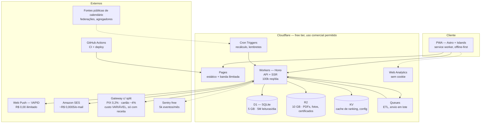
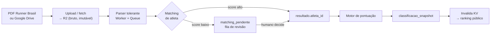
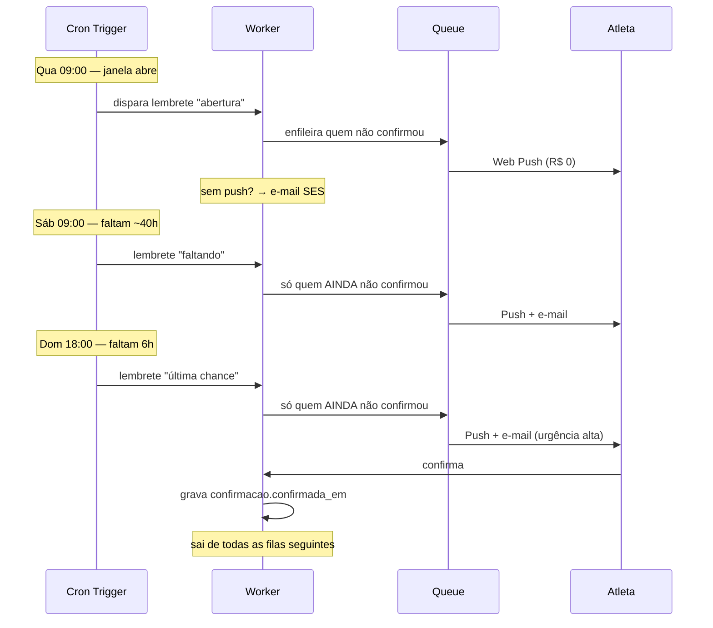
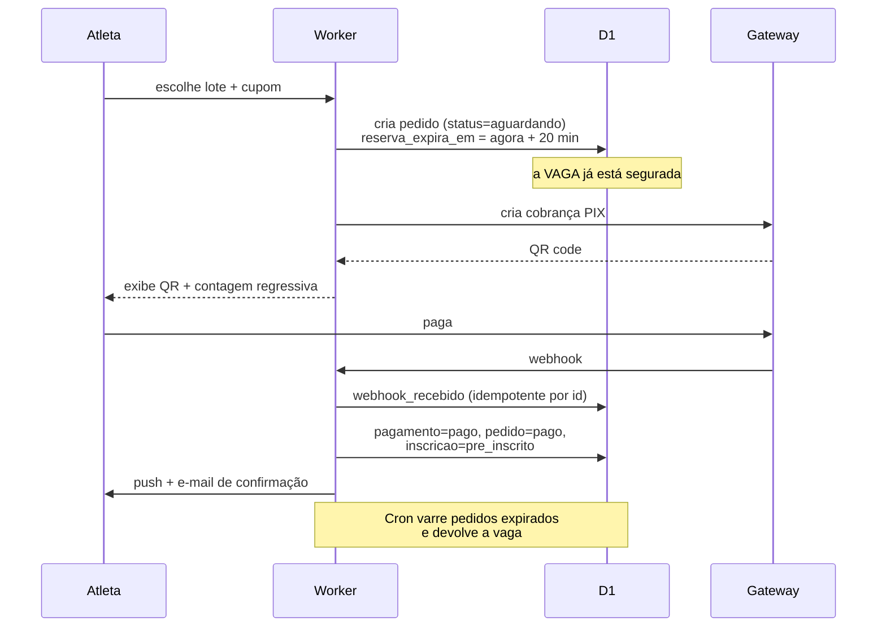
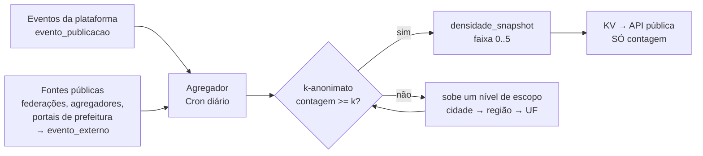

# 02 — Arquitetura e stack

> Como o KmZero funciona por dentro, com quais ferramentas, a que custo, e qual número exato obriga a migrar para o pago.
> Limites de free tier verificados em **agosto/2026** — todos mudam; a data importa.

---

## 1. O princípio que decide tudo

> **Custo marginal zero por usuário.**
> Toda escolha é testada contra uma pergunta: *o que acontece com a conta se o número de atletas dobrar?*
> Se a resposta não for "nada", a escolha está errada para esta fase.

Isso não é frugalidade. É o que permite o produto **existir indefinidamente sem receita**, e portanto não precisar monetizar antes de ter valor — que é a causa de morte mais comum de produto de comunidade.

Três corolários que aparecem repetidamente abaixo:

1. **Nada que cobre por assento.** Auth0, Clerk, Firebase Auth em volume — todos cobram por usuário ativo. Fora.
2. **Nada que durma.** O produto é sazonal: 5 etapas por ano, semanas de ociosidade entre elas. Um banco que pausa por inatividade acorda exatamente no pior momento.
3. **Nada que proíba uso comercial.** A plataforma vende inscrição desde o momento em que houver um evento pago (`01` §6). Uma stack cuja licença proíbe monetizar vira violação de contrato no primeiro cliente.

**Uma distinção que atravessa o documento:** custo **fixo** de infraestrutura precisa ser zero; custo **variável** de pagamento é proporcional à receita e não ameaça a premissa. Ver §10.

---

## 2. A stack



**O gateway é o único componente com custo variável, e ele só existe quando há evento pago.** Enquanto a plataforma tiver apenas eventos gratuitos — o caso do CSP —, o diagrama inteiro roda a R$ 0,00.

### 2.1 Por que Cloudflare, e não a stack "óbvia"

| Ferramenta | Free tier (ago/2026) | Veredito | Por quê |
|---|---|---|---|
| **Cloudflare Workers** | 100k req/dia, 10 ms CPU/invocação, banda ilimitada, **uso comercial permitido** | ✅ **Escolhida** | Único free tier grande que não proíbe monetizar |
| **Cloudflare Pages** | Builds 500/mês, banda ilimitada | ✅ **Escolhida** | Banda ilimitada importa: PDF de resultado e imagem de retrospectiva são pesados |
| **Cloudflare D1** | 5 GB, 5M linhas lidas/dia, 100k escritas/dia | ✅ **Escolhida** | Ver §2.2 para o dimensionamento |
| **Cloudflare R2** | 10 GB-mês, 1M ops classe A, 10M classe B | ✅ **Escolhida** | Sem taxa de egress — diferencial contra S3 |
| **Vercel Hobby** | 100 GB banda, ~100k invocações | ❌ **Rejeitada** | **ToS proíbe uso comercial.** Vira violação no dia em que houver receita |
| **Supabase free** | 500 MB, 50k MAU, **pausa após 7 dias sem query** | ❌ **Rejeitada** | Ver §2.3 — é desqualificante para *este* produto especificamente |
| **Neon free** | 0,5 GB, 100 CU-h/mês, scale-to-zero, cold start 1–3 s | 🟡 **Reserva** | Postgres real se o D1 apertar. Cold start aceitável, 0,5 GB não |
| **Turso** | 5 GB, 100 bancos, 500M leituras/mês | 🟡 **Reserva** | Desde jan/2026 removeu scale-to-zero em novos bancos AWS — passa a ter custo-base |
| **Firebase** | Generoso, mas cobra por leitura de documento | ❌ **Rejeitada** | Custo cresce com uso — viola o princípio da §1 |

### 2.2 Dimensionamento contra os limites reais

Vale fazer a conta, porque "cabe no free tier" sem número é fé.

**Cenário de pico — abertura de inscrição, o pior momento do ano:**

| Evento | Volume | Consumo |
|---|---|---|
| 2.000 atletas abrindo o app em ~30 min | ~2.000 sessões | |
| Páginas por sessão | ~8 | 16.000 requisições |
| Chamadas de API por sessão | ~15 | 30.000 requisições |
| Polling do contador de vagas (5 s, 30 min) | 2.000 × 360 | **720.000 requisições** ⚠️ |

**O polling estoura o limite sozinho.** 100k req/dia é o teto; 720k só de contador. Duas soluções, ambas aplicadas:

1. **O contador de vagas não faz polling ao Worker.** Ele lê um objeto no KV com `Cache-Control` curto, servido pela borda da Cloudflare — requisições em cache **não contam** contra o limite de Workers
2. **Server-Sent Events** para o contador durante a janela: uma conexão por atleta em vez de 360 requisições

Com isso: ~50k requisições no dia de pico, **metade do limite**.

**Cenário normal (dia comum):** ~200 atletas ativos × 20 requisições = 4.000/dia. **4% do limite.**

**Armazenamento no D1:**

| Tabela | Linhas estimadas (10 anos de histórico) | Tamanho |
|---|---|---|
| `atleta` | ~15.000 | ~5 MB |
| `resultado` | 15.000 × 5 etapas × 10 anos ≈ 750.000 | ~150 MB |
| `pontuacao` | ~750.000 | ~80 MB |
| `inscricao` + `confirmacao` | ~1.500.000 | ~200 MB |
| **Total** | | **~450 MB de 5 GB** |

**Folga de 10×.** O D1 não é o gargalo; o limite de escritas (100k/dia) também não — a maior escrita do ano é a importação de uma etapa, ~2.000 resultados + ~2.000 pontuações.

### 2.3 A rejeição do Supabase, em detalhe

Esta é a decisão mais contraintuitiva do documento e merece justificativa, porque Supabase seria a escolha natural (Postgres, auth pronta, realtime, ótima DX).

> **Projetos free do Supabase pausam após 7 dias sem atividade de banco.** Resumir leva ~30 segundos.

O CSP tem 5 etapas por ano. Entre a 2ª e a 3ª etapa podem passar **semanas** sem uma única query — o produto é sazonal por natureza. E o momento em que ele volta a ser usado é justamente a abertura da janela de confirmação: quarta-feira, 9h, 2.000 pessoas ao mesmo tempo, na funcionalidade mais crítica que existe.

O primeiro atleta a abrir o app encontraria 30 segundos de cold start. Não é um inconveniente de desenvolvimento — é o pior momento possível do ano inteiro.

Existe a gambiarra conhecida (um cron pingando o banco a cada 6 dias para mantê-lo vivo). Ela funciona, e é exatamente o tipo de fragilidade que não deve estar sob a funcionalidade mais importante do produto.

**Cloudflare D1 não tem conceito de pausa.** É por isso que ele ganha, apesar de ser SQLite e menos maduro.

---

## 3. Modelo de dados

Evolui o esboço da §6 do documento de descoberta, adaptado a SQLite/D1.

### 3.1 Decisões estruturais

**1. Evento avulso é campeonato de uma etapa.** Não existem entidades paralelas. `Edicao.modo = 'circuito' | 'prova'`. É essa decisão que permite ao atleta ter **um só histórico** atravessando campeonatos e provas isoladas — o ativo do produto.

**2. Regra de pontuação é dado, não código.** JSON versionado por edição. O regulamento muda todo ano; o deploy não pode depender disso.

**3. D1 não tem view materializada.** O ranking vive em `classificacao_snapshot`, recalculada por Cron Trigger após cada importação. Leitura de ranking é `SELECT` simples numa tabela pronta — barata e rápida, que é o que o pico exige.

**4. CPF fora da Fase 1.** Mitigação de LGPD já apontada na §8 da descoberta. Matching por nome + ano de nascimento + numeral, com fila de revisão.

### 3.2 Schema

```sql
-- ─────────────────────────────────────────────────────────
-- IDENTIDADE
-- ─────────────────────────────────────────────────────────
CREATE TABLE atleta (
  id              TEXT PRIMARY KEY,           -- ULID
  nome            TEXT NOT NULL,
  nome_normalizado TEXT NOT NULL,             -- lowercase, sem acento — para matching
  ano_nascimento  INTEGER,
  data_nascimento TEXT,                       -- ISO; null na Fase 1 se não confirmado
  sexo            TEXT CHECK (sexo IN ('F','M','X')),
  email           TEXT UNIQUE,
  cpf_hash        TEXT UNIQUE,                -- SHA-256 + pepper. NULL na Fase 1
  tipo_pcd        TEXT,                       -- código da categoria PCD, se houver
  perfil_publico  INTEGER NOT NULL DEFAULT 0, -- consentimento explícito, LGPD
  criado_em       TEXT NOT NULL,
  atualizado_em   TEXT NOT NULL
);
CREATE INDEX idx_atleta_matching ON atleta(nome_normalizado, ano_nascimento);
CREATE INDEX idx_atleta_email    ON atleta(email);

-- ─────────────────────────────────────────────────────────
-- ESTRUTURA DO CAMPEONATO
-- ─────────────────────────────────────────────────────────
CREATE TABLE organizacao (              -- multi-tenant desde o dia 1 (Caminho C)
  id        TEXT PRIMARY KEY,
  nome      TEXT NOT NULL,              -- 'SEMES — Prefeitura de Santos'
  slug      TEXT NOT NULL UNIQUE,       -- 'santos'
  criado_em TEXT NOT NULL
);

CREATE TABLE edicao (
  id               TEXT PRIMARY KEY,
  organizacao_id   TEXT NOT NULL REFERENCES organizacao(id),
  modo             TEXT NOT NULL CHECK (modo IN ('circuito','prova')),
  nome             TEXT NOT NULL,       -- '39º Campeonato Santista de Pedestrianismo'
  numero           INTEGER,             -- 39
  ano              INTEGER NOT NULL,
  regras_json      TEXT NOT NULL,       -- ver §3.3 — motor de pontuação
  regulamento_url  TEXT,
  criado_em        TEXT NOT NULL
);
CREATE INDEX idx_edicao_org ON edicao(organizacao_id, ano);

CREATE TABLE etapa (
  id              TEXT PRIMARY KEY,
  edicao_id       TEXT NOT NULL REFERENCES edicao(id),
  ordem           INTEGER NOT NULL,     -- 1..5
  nome            TEXT NOT NULL,        -- 'Rebouças'
  data            TEXT NOT NULL,        -- ISO
  local           TEXT,
  percurso_id     TEXT REFERENCES percurso(id),
  vagas_total     INTEGER,
  janela_abre     TEXT,                 -- confirmação: qua 9h
  janela_fecha    TEXT,                 -- confirmação: dom 23h59
  status          TEXT NOT NULL DEFAULT 'agendada'
                  CHECK (status IN ('agendada','inscricoes_abertas','realizada','cancelada')),
  UNIQUE (edicao_id, ordem)
);

CREATE TABLE percurso (                 -- o CSP repete locais entre anos
  id             TEXT PRIMARY KEY,
  organizacao_id TEXT NOT NULL REFERENCES organizacao(id),
  nome           TEXT NOT NULL,         -- 'Rebouças', 'Gonzaga/6º BPMI'
  distancia_km   REAL NOT NULL,
  geojson        TEXT,                  -- traçado; altimetria
  UNIQUE (organizacao_id, nome, distancia_km)
);

CREATE TABLE categoria (
  id           TEXT PRIMARY KEY,
  edicao_id    TEXT NOT NULL REFERENCES edicao(id),
  codigo       TEXT NOT NULL,           -- 'A'..'V'
  descricao    TEXT NOT NULL,
  sexo         TEXT CHECK (sexo IN ('F','M','X')),
  idade_min    INTEGER,
  idade_max    INTEGER,
  distancia_km REAL NOT NULL,
  tipo         TEXT NOT NULL CHECK (tipo IN ('faixa_etaria','pcd','participativa')),
  UNIQUE (edicao_id, codigo)
);

CREATE TABLE equipe (
  id        TEXT PRIMARY KEY,
  edicao_id TEXT NOT NULL REFERENCES edicao(id),
  nome      TEXT NOT NULL,
  gestor_id TEXT REFERENCES atleta(id),
  UNIQUE (edicao_id, nome)
);

-- ─────────────────────────────────────────────────────────
-- PARTICIPAÇÃO
-- ─────────────────────────────────────────────────────────
CREATE TABLE numeral (                  -- o ativo: identidade estável do atleta
  id         TEXT PRIMARY KEY,
  atleta_id  TEXT NOT NULL REFERENCES atleta(id),
  edicao_id  TEXT NOT NULL REFERENCES edicao(id),
  numero     TEXT NOT NULL,
  cor        TEXT,                      -- cor da categoria
  status     TEXT NOT NULL DEFAULT 'ativo'
             CHECK (status IN ('ativo','reemitido','cancelado')),
  UNIQUE (edicao_id, numero)
);

CREATE TABLE inscricao (
  id           TEXT PRIMARY KEY,
  atleta_id    TEXT NOT NULL REFERENCES atleta(id),
  edicao_id    TEXT NOT NULL REFERENCES edicao(id),
  equipe_id    TEXT REFERENCES equipe(id),
  categoria_id TEXT REFERENCES categoria(id),
  status       TEXT NOT NULL DEFAULT 'pre_inscrito'
               CHECK (status IN ('pre_inscrito','validado','cancelado','suspenso')),
  validada_em  TEXT,
  criado_em    TEXT NOT NULL,
  UNIQUE (atleta_id, edicao_id)
);

CREATE TABLE confirmacao (              -- o Art. 9º — o coração do produto
  id            TEXT PRIMARY KEY,
  inscricao_id  TEXT NOT NULL REFERENCES inscricao(id),
  etapa_id      TEXT NOT NULL REFERENCES etapa(id),
  confirmada_em TEXT,                   -- NULL = não confirmou = fora da etapa
  canal         TEXT,                   -- 'web' | 'push' | 'email' | 'presencial'
  UNIQUE (inscricao_id, etapa_id)
);
CREATE INDEX idx_confirmacao_etapa ON confirmacao(etapa_id, confirmada_em);

-- ─────────────────────────────────────────────────────────
-- RESULTADO E PONTUAÇÃO
-- ─────────────────────────────────────────────────────────
CREATE TABLE resultado (
  id             TEXT PRIMARY KEY,
  atleta_id      TEXT REFERENCES atleta(id),   -- NULL enquanto não houver matching
  etapa_id       TEXT NOT NULL REFERENCES etapa(id),
  categoria_id   TEXT REFERENCES categoria(id),
  numeral_texto  TEXT,                  -- como veio da cronometragem
  nome_bruto     TEXT NOT NULL,         -- como veio da cronometragem
  tempo_bruto_s  INTEGER,
  tempo_liquido_s INTEGER,
  pos_geral      INTEGER,
  pos_categoria  INTEGER,
  age_grade      REAL,                  -- % — calculado, ver §5
  status         TEXT NOT NULL DEFAULT 'concluido'
                 CHECK (status IN ('concluido','desistente','dns','dq')),
  importacao_id  TEXT REFERENCES importacao(id),
  criado_em      TEXT NOT NULL
);
CREATE INDEX idx_resultado_atleta ON resultado(atleta_id, etapa_id);
CREATE INDEX idx_resultado_etapa  ON resultado(etapa_id, pos_geral);

CREATE TABLE pontuacao (
  id              TEXT PRIMARY KEY,
  atleta_id       TEXT NOT NULL REFERENCES atleta(id),
  etapa_id        TEXT NOT NULL REFERENCES etapa(id),
  pontos_geral    INTEGER NOT NULL DEFAULT 0,
  pontos_categoria INTEGER NOT NULL DEFAULT 0,
  descartado      INTEGER NOT NULL DEFAULT 0,  -- 1 = pior resultado descartado
  regras_versao   TEXT NOT NULL,               -- rastreabilidade do cálculo
  calculado_em    TEXT NOT NULL,
  UNIQUE (atleta_id, etapa_id)
);

CREATE TABLE classificacao_snapshot (   -- substitui a view materializada
  id                TEXT PRIMARY KEY,
  edicao_id         TEXT NOT NULL REFERENCES edicao(id),
  atleta_id         TEXT NOT NULL REFERENCES atleta(id),
  escopo            TEXT NOT NULL CHECK (escopo IN ('geral','categoria','equipe')),
  escopo_ref        TEXT,               -- categoria_id ou equipe_id
  pontos_total      INTEGER NOT NULL,
  pontos_descartados INTEGER NOT NULL DEFAULT 0,
  bonus_assiduidade INTEGER NOT NULL DEFAULT 0,
  etapas_concluidas INTEGER NOT NULL DEFAULT 0,
  posicao           INTEGER NOT NULL,
  gap_proximo       INTEGER,            -- pontos até o de cima
  calculado_em      TEXT NOT NULL,
  UNIQUE (edicao_id, atleta_id, escopo, escopo_ref)
);
CREATE INDEX idx_class_ranking ON classificacao_snapshot(edicao_id, escopo, escopo_ref, posicao);

-- ─────────────────────────────────────────────────────────
-- ENGAJAMENTO
-- ─────────────────────────────────────────────────────────
CREATE TABLE conquista (
  id            TEXT PRIMARY KEY,
  atleta_id     TEXT NOT NULL REFERENCES atleta(id),
  tipo          TEXT NOT NULL,          -- 'marco_10_etapas', 'temporada_completa', ...
  obtida_em     TEXT NOT NULL,
  metadados_json TEXT,
  UNIQUE (atleta_id, tipo)
);

CREATE TABLE push_subscription (
  id           TEXT PRIMARY KEY,
  atleta_id    TEXT NOT NULL REFERENCES atleta(id),
  endpoint     TEXT NOT NULL UNIQUE,
  p256dh       TEXT NOT NULL,
  auth         TEXT NOT NULL,
  user_agent   TEXT,
  criado_em    TEXT NOT NULL,
  ultimo_ok_em TEXT,                    -- para expurgo de subscription morta
  falhas       INTEGER NOT NULL DEFAULT 0
);

CREATE TABLE preferencia_notificacao (
  atleta_id      TEXT PRIMARY KEY REFERENCES atleta(id),
  push_janela    INTEGER NOT NULL DEFAULT 1,
  push_resultado INTEGER NOT NULL DEFAULT 1,
  email_janela   INTEGER NOT NULL DEFAULT 1,
  email_resumo   INTEGER NOT NULL DEFAULT 1,
  atualizado_em  TEXT NOT NULL
);

-- ─────────────────────────────────────────────────────────
-- ETL E AUDITORIA
-- ─────────────────────────────────────────────────────────
CREATE TABLE importacao (
  id            TEXT PRIMARY KEY,
  etapa_id      TEXT NOT NULL REFERENCES etapa(id),
  fonte         TEXT NOT NULL,          -- 'runner_brasil_pdf', 'csv_manual', ...
  arquivo_r2    TEXT NOT NULL,          -- chave do bruto no R2 — nunca descartar
  linhas_lidas  INTEGER,
  linhas_ok     INTEGER,
  linhas_revisao INTEGER,
  status        TEXT NOT NULL DEFAULT 'processando'
                CHECK (status IN ('processando','revisao','concluida','falhou')),
  criado_em     TEXT NOT NULL
);

CREATE TABLE matching_pendente (        -- a fila de revisão humana
  id             TEXT PRIMARY KEY,
  resultado_id   TEXT NOT NULL REFERENCES resultado(id),
  candidatos_json TEXT NOT NULL,        -- [{atleta_id, score, motivo}]
  resolvido_em   TEXT,
  resolvido_por  TEXT,
  atleta_escolhido_id TEXT REFERENCES atleta(id)
);

CREATE TABLE aceite_termo (             -- requisito jurídico que não pode regredir
  id            TEXT PRIMARY KEY,
  atleta_id     TEXT NOT NULL REFERENCES atleta(id),
  termo_versao  TEXT NOT NULL,
  termo_hash    TEXT NOT NULL,          -- hash do texto aceito
  aceito_em     TEXT NOT NULL,
  ip            TEXT,
  user_agent    TEXT
);

-- ─────────────────────────────────────────────────────────
-- DESCOBERTA E COMÉRCIO
-- (a plataforma vende inscrição — ver 01 §1.1 e §6)
-- ─────────────────────────────────────────────────────────
CREATE TABLE usuario_organizacao (      -- quem administra o quê
  id             TEXT PRIMARY KEY,
  atleta_id      TEXT NOT NULL REFERENCES atleta(id),  -- conta única: a mesma
                                        -- pessoa pode correr E organizar
  organizacao_id TEXT NOT NULL REFERENCES organizacao(id),
  papel          TEXT NOT NULL CHECK (papel IN ('dono','admin','operador','leitura')),
  criado_em      TEXT NOT NULL,
  UNIQUE (atleta_id, organizacao_id)
);

CREATE TABLE evento_publicacao (        -- a camada de vitrine da `edicao`
  edicao_id       TEXT PRIMARY KEY REFERENCES edicao(id),
  slug            TEXT NOT NULL UNIQUE,
  publicado       INTEGER NOT NULL DEFAULT 0,  -- rascunho por padrão
  imagem_r2       TEXT,
  descricao_md    TEXT,
  cidade          TEXT NOT NULL,
  uf              TEXT NOT NULL,
  lat             REAL,                 -- para o Mapa de Datas (§6-C)
  lon             REAL,
  inscricoes_abrem TEXT,
  inscricoes_fecham TEXT,
  publicado_em    TEXT
);
CREATE INDEX idx_evento_vitrine ON evento_publicacao(publicado, inscricoes_abrem);
CREATE INDEX idx_evento_geo     ON evento_publicacao(uf, cidade);

CREATE TABLE lote (                     -- "1º lote", "2º lote" — padrão no Brasil
  id           TEXT PRIMARY KEY,
  edicao_id    TEXT NOT NULL REFERENCES edicao(id),
  nome         TEXT NOT NULL,
  preco_cents  INTEGER NOT NULL,        -- 0 = gratuito (CSP)
  vagas        INTEGER,
  inicia_em    TEXT NOT NULL,
  termina_em   TEXT,
  ordem        INTEGER NOT NULL,
  ativo        INTEGER NOT NULL DEFAULT 1
);

CREATE TABLE cupom (
  id            TEXT PRIMARY KEY,
  edicao_id     TEXT NOT NULL REFERENCES edicao(id),
  codigo        TEXT NOT NULL,
  tipo          TEXT NOT NULL CHECK (tipo IN ('percentual','valor_fixo')),
  valor         INTEGER NOT NULL,       -- % ou centavos
  usos_max      INTEGER,
  usos_atual    INTEGER NOT NULL DEFAULT 0,
  valido_ate    TEXT,
  ativo         INTEGER NOT NULL DEFAULT 1,
  UNIQUE (edicao_id, codigo)
);

CREATE TABLE pedido (
  id              TEXT PRIMARY KEY,
  atleta_id       TEXT NOT NULL REFERENCES atleta(id),
  edicao_id       TEXT NOT NULL REFERENCES edicao(id),
  lote_id         TEXT REFERENCES lote(id),
  cupom_id        TEXT REFERENCES cupom(id),
  subtotal_cents  INTEGER NOT NULL,
  desconto_cents  INTEGER NOT NULL DEFAULT 0,
  taxa_cents      INTEGER NOT NULL DEFAULT 0,  -- a receita do KmZero
  total_cents     INTEGER NOT NULL,
  repasse_cents   INTEGER NOT NULL,            -- o que vai ao organizador
  status          TEXT NOT NULL DEFAULT 'aguardando'
                  CHECK (status IN ('aguardando','pago','expirado','cancelado','estornado')),
  reserva_expira_em TEXT,                      -- segura a vaga durante o pagamento
  criado_em       TEXT NOT NULL
);
CREATE INDEX idx_pedido_reserva ON pedido(status, reserva_expira_em);
CREATE INDEX idx_pedido_evento  ON pedido(edicao_id, status, criado_em);

CREATE TABLE pagamento (
  id             TEXT PRIMARY KEY,
  pedido_id      TEXT NOT NULL REFERENCES pedido(id),
  meio           TEXT NOT NULL CHECK (meio IN ('pix','cartao','boleto','gratuito')),
  gateway        TEXT,
  gateway_ref    TEXT,                  -- id da transação no gateway
  custo_cents    INTEGER,               -- custo real do meio (ver 01 §6.2)
  status         TEXT NOT NULL,
  pago_em        TEXT,
  payload_json   TEXT,                  -- resposta bruta, para conciliação
  UNIQUE (gateway, gateway_ref)
);

CREATE TABLE webhook_recebido (         -- idempotência do gateway
  id           TEXT PRIMARY KEY,        -- id do evento no gateway
  gateway      TEXT NOT NULL,
  tipo         TEXT NOT NULL,
  processado_em TEXT,
  payload_json TEXT NOT NULL,
  recebido_em  TEXT NOT NULL
);

CREATE TABLE favorito (                 -- motor de retenção do lado atleta
  atleta_id  TEXT NOT NULL REFERENCES atleta(id),
  edicao_id  TEXT NOT NULL REFERENCES edicao(id),
  criado_em  TEXT NOT NULL,
  notificado_abertura_em TEXT,          -- evita disparo duplicado
  PRIMARY KEY (atleta_id, edicao_id)
);
CREATE INDEX idx_favorito_evento ON favorito(edicao_id, notificado_abertura_em);

CREATE TABLE kit (                      -- camiseta, chip, sacola
  id          TEXT PRIMARY KEY,
  edicao_id   TEXT NOT NULL REFERENCES edicao(id),
  nome        TEXT NOT NULL,
  tamanhos_json TEXT,                   -- ["PP","P","M","G","GG"]
  retirada_local TEXT,
  retirada_janela TEXT
);

CREATE TABLE checkin (
  id           TEXT PRIMARY KEY,
  inscricao_id TEXT NOT NULL REFERENCES inscricao(id),
  etapa_id     TEXT REFERENCES etapa(id),
  tipo         TEXT NOT NULL CHECK (tipo IN ('validacao','retirada_kit','largada')),
  operador_id  TEXT REFERENCES atleta(id),
  registrado_em TEXT NOT NULL
);

-- ─────────────────────────────────────────────────────────
-- MAPA DE DATAS — inteligência de calendário (ver §6-C)
-- ─────────────────────────────────────────────────────────
CREATE TABLE evento_externo (           -- provas de fontes públicas, não da plataforma
  id           TEXT PRIMARY KEY,
  fonte        TEXT NOT NULL,           -- 'federacao_sp', 'agregador_x', ...
  fonte_ref    TEXT,
  data         TEXT NOT NULL,
  cidade       TEXT NOT NULL,
  uf           TEXT NOT NULL,
  lat          REAL,
  lon          REAL,
  coletado_em  TEXT NOT NULL,
  UNIQUE (fonte, fonte_ref)
);
CREATE INDEX idx_externo_data ON evento_externo(data, uf, cidade);

CREATE TABLE densidade_snapshot (       -- SÓ CONTAGEM. Nunca identidade de evento.
  id            TEXT PRIMARY KEY,
  data          TEXT NOT NULL,
  escopo        TEXT NOT NULL CHECK (escopo IN ('cidade','regiao','uf')),
  escopo_ref    TEXT NOT NULL,
  contagem      INTEGER NOT NULL,
  faixa         INTEGER NOT NULL,       -- 0..5 — o que a UI exibe (§6-C)
  suprimido     INTEGER NOT NULL DEFAULT 0,  -- 1 = abaixo do k mínimo
  calculado_em  TEXT NOT NULL,
  UNIQUE (data, escopo, escopo_ref)
);
```

### 3.2.1 Uma conta só, dois papéis

`usuario_organizacao` liga `atleta` a `organizacao`. **Não existe tabela separada de "usuário organizador"** — a mesma pessoa corre e organiza, o que é comum no meio (assessorias, clubes, ex-atletas). Duas contas separadas quebrariam o histórico, que é o ativo do produto.

### 3.3 O motor de pontuação como configuração

O risco identificado na §8 da descoberta — *"regulamento muda a cada edição"* — resolvido tratando regra como dado. `edicao.regras_json`:

```json
{
  "versao": "csp-39-v1",
  "pontos_por_posicao": {
    "1": 25, "2": 22, "3": 20, "4": 18, "5": 16,
    "6": 15, "7": 13, "8": 12, "9": 11, "10": 10
  },
  "pontos_participacao": 1,
  "escopos": ["geral", "categoria"],
  "escopos_independentes": true,
  "descarte": {
    "estrategia": "pior_resultado_ou_falta",
    "quantidade": 1
  },
  "bonus_assiduidade": [
    { "etapas_concluidas": 5, "pontos": 6 },
    { "etapas_concluidas": 4, "pontos": 4 }
  ],
  "premiacao": {
    "minimo_provas_concluidas": 2
  },
  "equipe": {
    "quorum": { "M": 5, "F": 3 },
    "criterio": "soma_pontos_membros"
  },
  "desempate": ["melhor_posicao_ultima_etapa", "maior_numero_vitorias", "menor_tempo_total"],
  "migracao_pontos_entre_categorias": false
}
```

**Estratégias de descarte são plugáveis** — `pior_resultado_ou_falta`, `n_melhores`, `sem_descarte`. Cada uma é uma função pura no Worker; o JSON escolhe qual roda. Regulamento novo = novo JSON, não novo deploy.

**Rastreabilidade:** `pontuacao.regras_versao` grava qual versão calculou cada linha. Quando um recurso for julgado e o resultado mudar, dá para saber exatamente o que foi recalculado e com que regra.

### 3.4 Recálculo idempotente

Resultados mudam depois da prova — desclassificações, recursos até 12h do dia útil seguinte. O recálculo:

1. É disparado por Cron Trigger ou por evento de importação
2. Roda **sempre do zero** para a edição inteira (não incremental) — 2.000 atletas × 5 etapas é trivial computacionalmente e elimina classes inteiras de bug
3. Grava `classificacao_snapshot` em transação
4. Invalida a chave correspondente no KV

Rodar do zero é a decisão certa aqui: o custo é irrelevante na escala do produto e a correção é garantida.

---

## 4. ETL de resultados

O documento de descoberta identifica isto como investimento que vale a pena (§6): *"o histórico profundo é justamente o que dá valor ao dashboard no dia 1"*.



### 4.1 Regras que não podem ser negociadas

**O arquivo bruto vai para o R2 antes de qualquer parsing, e nunca é apagado.** Quando o formato mudar (e vai mudar), o reprocessamento é possível. 10 GB de free tier comportam décadas de PDF de resultado.

**O parser falha para a linha, não para o arquivo.** Uma linha ilegível vira `matching_pendente`, não aborta a importação.

**Matching de atleta — o problema central** (RunSignup dedica um módulo inteiro a isso):

| Sinal | Peso | Observação |
|---|---|---|
| CPF (quando existir) | Decisivo | Fase 2+ |
| Numeral + edição | Alto | Numeral é único por edição — chave forte dentro do ano |
| Nome normalizado exato + ano de nascimento | Alto | |
| Nome normalizado exato, sem data | Médio | Homônimos existem |
| Distância de Levenshtein ≤ 2 + categoria igual | Baixo | Erro de digitação da cronometragem |

Score ≥ 0,9 casa automaticamente. Entre 0,6 e 0,9 vai para revisão com os candidatos ranqueados. Abaixo de 0,6 cria atleta novo, "não reivindicado" — o modelo de *claim* do Athlinks.

---

## 5. Age grading

Merece seção própria porque é decisão de produto, não detalhe técnico (ver `01` §5).

- **Fonte:** tabelas WMA (World Masters Athletics), públicas, por sexo, idade e distância
- **Implementação:** tabela estática no repositório (não é dado de banco — muda a cada 4–5 anos)
- **Cálculo:** `age_grade = (tempo_padrão_para_idade_e_sexo / tempo_do_atleta) × 100`
- **Onde aparece:** no `resultado`, calculado na importação; exibido como badge no dashboard

**Por que importa aqui mais que em qualquer outro produto:** o CSP tem categorias até 80+. Sem age grading, o produto entrega uma mensagem de declínio contínuo ao público que mais precisa de permanência. Com ele, um atleta de 68 anos vê que está melhorando mesmo com o relógio mais lento.

---

## 6. Notificação: a cascata por custo

A §4.1 da descoberta lista *"Push + e-mail + WhatsApp/SMS"* como se fossem intercambiáveis. **Custam ordens de grandeza diferentes** e precisam ser uma cascata, não uma lista.

| Canal | Custo real | Alcance | Fase |
|---|---|---|---|
| **Web Push (VAPID)** | **R$ 0,00, ilimitado, sem intermediário** | Só quem instalou o PWA. iOS exige 16.4+ e instalação na tela inicial | **1 — primário** |
| **E-mail (Amazon SES)** | ~US$ 0,10/1.000 → **8.000 msgs ≈ R$ 1,00/mês** | Universal | **1 — reforço** |
| **WhatsApp (utility)** | ~US$ 0,0068/msg + margem BSP 10–30% → **6.000 msgs ≈ R$ 220–280/mês** | Maior abertura no Brasil | **2 — quando houver receita** |

Free tiers de e-mail transacional foram avaliados e **nenhum serve**:

- **Resend free:** 100 e-mails/**dia**. Um disparo para 2.000 atletas levaria 20 dias
- **Brevo free:** 300/dia, marketing e transacional somados. Mesmo problema

SES não tem free tier permanente relevante, mas custa tão pouco que é irrelevante: **um disparo completo para 2.000 atletas custa R$ 0,20.** Cabe na premissa de custo zero por arredondamento.

### 6.1 Régua de lembretes da janela de confirmação



**A regra que economiza dinheiro e respeito:** cada disparo consulta quem ainda não confirmou. Quem já confirmou nunca mais recebe lembrete daquela etapa. Volume real de e-mail cai de 3×2.000 para algo entre 2.000 e 3.500 por janela.

### 6.2 O gargalo honesto do Web Push

Web Push exige que o atleta **instale o PWA** e **conceda permissão**. Num público 60+ isso é atrito real, e é a fraqueza conhecida desta escolha.

Mitigações:

1. **Não pedir permissão na primeira visita.** Pedir depois de um momento de valor — quando o atleta vê o próprio histórico pela primeira vez
2. **E-mail é o padrão, push é o upgrade.** Ninguém fica sem lembrete por não instalar
3. **Instruções visuais de instalação**, diferentes para Android e iOS, no fluxo de onboarding
4. **Medir a taxa de adesão.** Se ficar abaixo de ~25% após a primeira temporada, a Hipótese do canal cai e o WhatsApp entra antes do previsto

---

## 6-B. Pagamentos

A plataforma vende inscrição (`01` §1.1). Isso introduz o primeiro custo variável do produto — e ele é proporcional à receita, então não viola a premissa da §1.

### 6-B.1 A decisão que vale dinheiro: PIX como padrão

| Meio | Taxa 2026 | Custo numa inscrição de R$ 80 | Sobra da taxa de 8% (R$ 6,40) |
|---|---|---|---|
| **PIX** | **0,10 – 0,22%** | **R$ 0,08 – 0,18** | **~R$ 6,25 (97%)** |
| Cartão de crédito | 3,99 – 5,49% | R$ 3,19 – 4,39 | ~R$ 2,50 (40%) |
| Boleto | tarifa fixa ~R$ 2–4 | R$ 2–4 | ~R$ 3 |

**Consequência de arquitetura, não de marketing:** PIX é o caminho padrão do checkout, pré-selecionado, com o QR aparecendo antes de qualquer formulário de cartão. Cartão existe para quem quer parcelar.

Bônus não financeiro: **PIX não tem chargeback.** Some uma classe inteira de fraude e de disputa.

### 6-B.2 Escolha de gateway

Requisito eliminatório: **split nativo** — a plataforma precisa reter a taxa e repassar o resto ao organizador sem passar o dinheiro pela própria conta (o que exigiria licença e mudaria a natureza jurídica da operação).

| Gateway | Split | PIX | Repasse | Veredito |
|---|---|---|---|---|
| **Pagar.me** | ✅ nativo, flexível | ✅ | Configurável | ✅ **Escolha** — split maduro, documentação boa |
| **Mercado Pago** | ✅ nativo | ✅ | ~1 dia útil | 🟡 Alternativa forte; taxas de cartão mais altas |
| **Asaas** | ✅ | ✅ | Configurável | 🟡 Boa opção para volume menor |
| **Stripe** | ✅ Connect | 🟡 | até 7 dias úteis | ❌ Repasse lento e cartão caro para o mercado BR |

⚠️ **Taxas de gateway são negociáveis por volume.** Os números acima são de tabela pública e servem para modelar, não para fechar contrato.

### 6-B.3 Fluxo, e as três regras que evitam os bugs caros



1. **A vaga é reservada na criação do pedido, não no pagamento.** Sem isso, o atleta paga e descobre que a vaga acabou — o pior desfecho possível
2. **Todo webhook é idempotente**, com a chave sendo o id do evento no gateway (`webhook_recebido`). Gateways reenviam; processar duas vezes duplica inscrição
3. **O gateway é a verdade sobre dinheiro, o D1 é a verdade sobre vaga.** Conciliação diária por Cron compara os dois e levanta divergência — nunca "corrige" sozinha

### 6-B.4 O que fica fora do escopo próprio

Emissão de nota fiscal da taxa de conveniência, antecipação de recebíveis e KYC do organizador são resolvidos pelo gateway ou por serviço contábil. **Não construir.**

---

## 6-C. Mapa de Datas

A funcionalidade que dá valor ao organizador antes de ele migrar qualquer evento (`01` §5-B). Tecnicamente simples; a dificuldade toda está em **não vazar informação**.

### 6-C.1 Fontes



**Deduplicação** entre a plataforma e fontes externas por `(data, cidade, nome normalizado)` com distância de Levenshtein — o mesmo evento aparece nas duas origens e não pode ser contado duas vezes.

### 6-C.2 As regras de não-vazamento

O usuário definiu a restrição de negócio com precisão: *"não mostraremos informações dos eventos por questões de mercado"*. Traduzida em regras verificáveis:

| Regra | Implementação |
|---|---|
| **Nunca retornar identidade** | A API de densidade não tem acesso à tabela de eventos. Ela lê **apenas** `densidade_snapshot`. Não é política — é isolamento de dados |
| **k-anonimato mínimo** | Contagem < **k=3** num escopo não é exibida; sobe para o escopo maior (cidade → região metropolitana → UF) até atingir k |
| **Faixas, não números exatos** | A UI exibe `0 · 1-2 · 3-4 · 5-6 · 7+`. Contagem exata só a partir de k. Faixa protege e ainda responde à pergunta do organizador |
| **Sem granularidade fina de local** | Escopo mínimo é o município. Nunca bairro, nunca coordenada |
| **Sem histórico consultável de evento** | O snapshot guarda contagem por data, não a série temporal de um evento específico |
| **Rate limit na API pública** | Impede reconstruir o calendário por varredura sistemática |

⚠️ **O ataque que sobra, e ele é real:** um organizador que conhece bem sua cidade pode inferir de quem é a prova mesmo com contagem agregada. Não há solução técnica completa. As mitigações são o k mínimo e a faixa — e a decisão consciente de que **o mapa vale mais para o mercado do que o risco residual**, já que os calendários que o alimentam são majoritariamente públicos. Isso deve estar escrito nos termos de uso do organizador.

### 6-C.3 Custo

O cálculo roda uma vez por dia por Cron Trigger, para um horizonte de 12 meses. Resultado no KV, servido pela borda. **Custo marginal por consulta: zero.**

---

## 6-D. Motor de elegibilidade

O usuário descreveu: *"vai ser possível se inscrever na nova etapa caso ele preencha os requisitos do regulamento"*. Isso é uma regra por edição, não código — mesma decisão do motor de pontuação (§3.3).

Extensão de `edicao.regras_json`:

```json
{
  "elegibilidade": {
    "etapa_1": [
      { "regra": "vaga_disponivel" },
      { "regra": "termo_aceito", "versao": "39-v1" }
    ],
    "etapa_n": [
      { "regra": "inscrito_na_edicao" },
      { "regra": "confirmou_na_janela", "janela": "qua_09h_dom_2359" },
      { "regra": "nao_faltou_etapa_anterior" },
      { "regra": "nao_suspenso" }
    ]
  }
}
```

Cada regra é uma função pura `(atleta, etapa, historico) → { elegivel, motivo, comoResolver }`.

**A parte que importa mais que a lógica:** quando o atleta **não** é elegível, a resposta traz `motivo` e `comoResolver` em linguagem simples, e a interface mostra os dois. Um botão desabilitado sem explicação é a falha de UX mais cara que existe neste fluxo — e é exatamente o que o sistema atual faz ao esconder botões com `display:none`.

---

## 7. Autenticação

**E-mail e senha, com Firebase Auth.**

| Componente | Implementação |
|---|---|
| Entrar | `signInWithEmailAndPassword` no navegador |
| Criar conta | `createUserWithEmailAndPassword` + verificação de e-mail |
| Recuperação | `sendPasswordResetEmail` → link de uso único, 1 hora |
| Sessão | Gerida pelo SDK, com refresh token no navegador |
| E-mails transacionais da conta | Do próprio Firebase, com template em português e remetente do domínio |
| Rate limiting e proteção contra bot | Limites nativos do Firebase Auth |
| Custo | **R$ 0,00 até 50 mil usuários ativos por mês** |

**Decisão revista.** A versão anterior desta seção especificava magic link
por e-mail e rejeitava o Firebase Auth "por cobrar por assento". A rejeição
não se sustentava: o nível gratuito do Firebase Auth cobre 50 mil usuários
ativos por mês, e só depois disso passa a cobrar por MAU — ordens de
grandeza acima da escala prevista aqui. E-mail e senha é o que o público
espera encontrar, e essa expectativa vale mais do que a economia de um
passo no fluxo.

**O que a mudança custa, e que fica registrado:**

| Custo | Consequência |
|---|---|
| Senha esquecida volta a existir | Era o modo de falha dominante do sistema atual — CPF + senha, recuperação só por CPF. A resposta é o "esqueci minha senha" ser de primeira classe: link visível ao lado do campo, sem CAPTCHA, e trocar a senha em duas telas |
| Entrar passa a exigir JavaScript | O login roda no navegador, via SDK. As páginas públicas — busca, filtros, listagem — continuam funcionando sem JS (§8 item 17 do design system); só as telas de conta não |
| Dependência de terceiro | Se o Firebase mudar preço ou política, migrar significa reimplementar a autenticação. O código isola isso num adaptador de seis métodos (`apps/web/js/conta.js`), para a troca não atravessar a interface |
| Dado pessoal fora do Brasil | Contas ficam em servidor do Google. Precisa estar declarado na política de privacidade (`B7`), e o CPF continua valendo a regra do §11: só como hash, nunca em claro, e nunca no provedor de autenticação |

**Senha:** mínimo de 8 caracteres e bloqueio de sequências óbvias. **Sem
regra de composição** — exigir símbolo e maiúscula empurra todo mundo para
`Senha@123`, que é pior do que quatro palavras seguidas. Campo de senha
sempre com botão de mostrar: para um público que vai até 80+, conferir o
que se digitou é o que evita o bloqueio por tentativas.

**Anti-enumeração:** senha errada e e-mail inexistente devolvem a mesma
mensagem, e a confirmação do "esqueci minha senha" nunca revela se a conta
existe.

**CAPTCHA:** Cloudflare Turnstile continua disponível para o fluxo público
se os limites nativos do Firebase não bastarem. **Nunca em sessão
autenticada** — o problema da §2.4.3 da descoberta.

---

## 8. Anti-pico: a abertura das inscrições

O pior momento do ano, arquitetado explicitamente.

| Problema | Solução |
|---|---|
| 2.000 pessoas dando F5 | Contador no KV com cache de borda; SSE durante a janela. Cache não conta contra o limite de Workers |
| Corrida por vaga | Contador atômico em Durable Object; reserva com TTL antes da confirmação |
| Duplo clique = dupla inscrição | Chave de idempotência por `(atleta_id, etapa_id)` — o `UNIQUE` do schema já garante |
| Fila injusta | Token de fila com timestamp; ordem de chegada respeitada e **visível** |
| Bot | Turnstile no público + rate limiting. Zero CAPTCHA no autenticado |

⚠️ **Durable Objects não estão no free tier** — exigem o plano Workers Paid (US$ 5/mês). Fase 1 não faz inscrição (Caminho A da descoberta), então não é problema agora. Quando a Fase 3 chegar, o produto já terá receita ou a alternativa é serializar via D1 com `UNIQUE` + retry.

---

## 9. CI/CD e observabilidade

| Necessidade | Ferramenta | Free tier | Suficiente? |
|---|---|---|---|
| Repositório + CI | GitHub Actions | 2.000 min/mês privado, **ilimitado se público** | ✅ Deploy leva ~2 min |
| Deploy | Wrangler via Actions | — | ✅ |
| Erros | Sentry | 5k eventos/mês | ✅ Se estourar, é sintoma de bug, não de escala |
| Analytics | **Cloudflare Web Analytics** | Ilimitado | ✅ **Sem cookie** — bônus de LGPD, dispensa banner |
| Logs | Workers Logs | 200k eventos/dia | ✅ |
| Uptime | UptimeRobot | 50 monitores | ✅ |
| Board | GitHub Projects | Ilimitado | ✅ |

**Considerar tornar o repositório público.** Além de Actions ilimitado, um produto de comunidade construído às claras ganha confiança — e o código não é o ativo, o histórico é.

---

## 10. Quando migrar para o pago

A tabela que evita tanto a surpresa na fatura quanto a migração prematura.

Duas categorias que não devem ser confundidas:

- **Custo fixo de infraestrutura** — o que a premissa da §1 protege. Precisa ser R$ 0 enquanto não houver receita
- **Custo variável de pagamento** — só existe quando entra dinheiro, é proporcional à receita e não ameaça premissa nenhuma (§6-B.1)

| Gatilho medido | Ação | Custo |
|---|---|---|
| **> 80k req/dia por 3 dias seguidos** | Workers Paid | **US$ 5/mês** — 10M req incluídas + Durable Objects |
| **Primeiro evento PAGO publicado** | Workers Paid (Durable Objects para reserva de vaga) + gateway | US$ 5/mês + variável |
| **D1 > 4 GB** ou **> 4M leituras/dia** | Workers Paid (D1 escala junto) | Incluso |
| **> 40k e-mails/mês** | Já é SES; custo cresce linear | ~US$ 4/mês |
| **Sentry > 4k eventos/mês** | Investigar bugs antes de pagar | — |
| **Receita recorrente entrando** | Domínio próprio + WhatsApp BSP | ~US$ 60/mês |

**Degrau 0 — hoje, só eventos gratuitos:** R$ 0,00 + ~R$ 1,00 de SES. Sem gateway, sem custo variável.
**Degrau 1 — primeiro evento pago:** ~US$ 5/mês fixo + ~0,2% de PIX sobre o que for vendido.
**Degrau 2 — operação com receita:** ~US$ 60/mês fixo contra receita de dezenas de milhares por ano (`01` §6.2).

O produto atravessa os três degraus sem nunca ter custo que exija decisão difícil, e **pode permanecer no degrau 0 indefinidamente** enquanto só houver eventos gratuitos. Era esse o objetivo da premissa.

---

## 11. Checklist LGPD

Aplicado às escolhas de arquitetura, não genérico.

| Requisito | Como esta arquitetura atende |
|---|---|
| **Minimização** | Fase 1 coleta nome, e-mail, ano de nascimento. **Sem CPF, sem RG, sem endereço, sem escolaridade** — o oposto dos 21 campos do sistema atual |
| **Base legal** | Legítimo interesse para resultado (dado já público); **consentimento explícito** para perfil público e notificação |
| **Consentimento granular** | `atleta.perfil_publico` e tabela `preferencia_notificacao`. Opt-in, nunca opt-out |
| **Direito de acesso** | Exportação do próprio histórico em JSON/CSV — funcionalidade de produto, não só obrigação |
| **Direito de eliminação** | Anonimização: `atleta.nome → 'Atleta removido'`, e-mail nulo, resultado preservado sem vínculo (o resultado é registro público de prova) |
| **Retenção** | `push_subscription` expurgada após 3 falhas; sessões após 90 dias; logs após 30 dias |
| **Segurança** | CPF, se e quando coletado, apenas como SHA-256 + pepper em Workers Secret. Nunca em claro |
| **Transferência internacional** | D1 na região `auto`; **fixar em `wnam`/`enam` documentado**, ou avaliar região South America quando disponível |
| **Cookies** | Cloudflare Web Analytics não usa cookie. **Só o cookie de sessão existe** — essencial, dispensa banner de consentimento |
| **Encarregado (DPO)** | Definir antes do lançamento público. Item de `04` |
| **Dado de pagamento** | **Nunca trafega nem é armazenado pelo KmZero.** Cartão vai direto ao gateway por tokenização; o D1 guarda só `gateway_ref` e status. Isso mantém o produto fora do escopo PCI-DSS completo |
| **Dado do organizador** | CNPJ, conta bancária e KYC ficam no gateway, não no D1. O produto guarda apenas a referência do recebedor |
| **Mapa de Datas** | Agrega evento, não pessoa — fora do escopo de dado pessoal. A restrição é **concorrencial**, e está em §6-C.2 |
| **Nota fiscal e retenção contábil** | A obrigação de guarda de documento fiscal (5 anos) convive com o direito de eliminação: anonimizar o atleta **não** apaga o pedido, que é registro fiscal. Documentar essa separação na política de privacidade |

⚠️ **Ponto que exige decisão humana:** se o KmZero publicar perfis de atletas a partir de resultados públicos **antes** de o atleta criar conta (modelo *claim* do Athlinks), isso é tratamento de dado pessoal sem consentimento prévio. É defensável por legítimo interesse (dado divulgado publicamente pelo organizador), mas exige opt-out fácil e visível. **Consultar advogado antes da Fase 1.**

---

## 12. Estrutura de repositório proposta

```
kmzero/
├── apps/
│   ├── web/                    # Astro + islands → Cloudflare Pages
│   │   ├── src/pages/          # rotas públicas (SSG) e do atleta (SSR)
│   │   ├── src/components/     # consome docs/design/tokens.css
│   │   └── public/sw.js        # service worker: push + offline
│   ├── organizador/            # console — SPA, densidade maior (03 §6-C)
│   └── api/                    # Worker (Hono)
│       ├── src/routes/
│       ├── src/pontuacao/      # motor plugável — estratégias de descarte
│       ├── src/elegibilidade/  # regras por edição (§6-D)
│       ├── src/pagamento/      # gateway, split, webhooks, conciliação (§6-B)
│       ├── src/densidade/      # agregação do Mapa de Datas + k-anonimato (§6-C)
│       ├── src/etl/            # parsers + matching
│       └── src/notificacao/    # cascata push → e-mail
├── packages/
│   ├── schema/                 # DDL + migrações D1
│   └── shared/                 # tipos, validação (zod), age grading (WMA)
├── docs/                       # esta documentação
└── .github/workflows/          # CI + deploy Wrangler
```

**Por que Astro e não Next.js:** a maior parte do produto é conteúdo público que deve ser estático e rápido (calendário, resultados, rankings, perfis). Astro gera estático por padrão e hidrata só o que precisa de interação. Menos JavaScript no celular do público 60+ é requisito de acessibilidade, não preferência técnica. Next.js na Cloudflare também funciona, mas paga overhead que este produto não precisa.

---

## 13. Riscos técnicos

| Risco | Impacto | Mitigação |
|---|---|---|
| **D1 é SQLite** — sem window function avançada, sem view materializada, menos maduro | Médio | `classificacao_snapshot` já contorna. Neon é a saída se doer |
| **Limite de 10 ms de CPU por invocação** | Médio | Recálculo de ranking vai para Queue, não para requisição de usuário |
| **Cloudflare muda o free tier** | Alto | Toda a lógica está em Workers (padrão web) e SQL. Migrar para Neon + Deno Deploy custaria semanas, não meses |
| **Adesão baixa ao Web Push** | Alto — atinge a funcionalidade principal | E-mail é o padrão; medir e reavaliar após a 1ª temporada (§6.2) |
| **Formato dos resultados muda** | Médio | Bruto no R2, parser tolerante, fila de revisão |
| **Durable Objects fora do free tier** | Baixo | Necessário a partir do primeiro evento pago, quando US$ 5/mês é irrelevante |
| **Reserva de vaga vence enquanto o atleta paga** | **Alto** — atleta paga e perde a vaga | TTL de 20 min folgado para PIX; Cron devolve a vaga; se o pagamento chegar após o vencimento e não houver vaga, **estorno automático e imediato**, nunca disputa manual |
| **Webhook do gateway duplicado ou fora de ordem** | Alto — inscrição duplicada ou cobrança dupla | `webhook_recebido` com o id do gateway como chave primária; processamento idempotente (§6-B.3) |
| **Divergência entre gateway e D1** | Alto — dinheiro sem vaga ou vaga sem dinheiro | Conciliação diária por Cron que **levanta** divergência, nunca corrige sozinha |
| **Fontes públicas do Mapa de Datas mudam ou somem** | Médio — o mapa perde precisão | Múltiplas fontes, guardar o bruto, degradar para os eventos da própria plataforma |
| **Inferência de identidade no Mapa de Datas** | Médio — reputacional com organizadores | k-anonimato (k=3), exibição em faixas, rate limit. Risco residual assumido e declarado nos termos (§6-C.2) |

---

## Fontes

- [Cloudflare Workers Free Tier 2026 — limites e mudanças](https://agentdeals.dev/vendor/cloudflare-workers)
- [Cloudflare Workers + Hono + D1 + R2 Free Stack 2026](https://www.buildmvpfast.com/blog/cloudflare-workers-hono-d1-r2-free-fullstack-2026)
- [Cloudflare Free Tier Limits Checklist — CDN, DNS, WAF, Workers](https://eastondev.com/blog/en/posts/dev/20260526-cloudflare-free-limits/)
- [Vercel free tier limits in 2026: what you actually get on Hobby](https://www.promptstoproduct.com/vercel-free-tier-limits)
- [Supabase Free Tier Limits in 2026: Hidden Pauses & Caps](https://www.itpathsolutions.com/supabase-free-tier-limits)
- [Neon Free Tier 2026: Limits, Pricing & What Changed](https://agentdeals.dev/vendor/neon)
- [Neon vs Turso: Serverless Postgres vs Edge SQLite](https://www.13labs.au/compare/neon-vs-turso)
- [Resend Free Tier Explained (2026)](https://automationatlas.io/answers/resend-free-tier-explained-2026/)
- [Brevo Free Plan 2026: 300 Emails/Day, Pricing & Limits](https://www.fastlancer.org/en/fastlancer-blog/brevo-review/)
- [WhatsApp Business API Pricing Brazil 2026 (BRL)](https://whautomate.com/whatsapp-business-api-pricing-brazil)
- [WhatsApp Business API Pricing 2026: Per-Message Rates](https://setsmart.io/blog/whatsapp-business-api-pricing)
