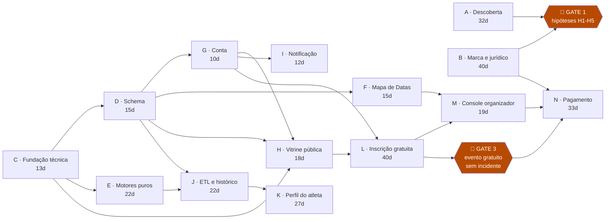

# 05 — Backlog de execução

> Todas as tarefas do projeto ordenadas por **dependência**: uma tarefa só aparece numa onda quando **todos** os seus pré-requisitos já foram concluídos em ondas anteriores.
>
> A ordenação não foi escrita à mão — foi calculada por ordenação topológica sobre o grafo de dependências, e o grafo foi verificado contra ciclos.
>
> **95 tarefas · 15 ondas · 318 dias-pessoa · caminho crítico de 59 dias**

---

## Como ler este documento

### Onda ≠ cronograma

Uma **onda** responde a "o que já pode ser feito", não a "o que será feito nesta semana". A Onda 3 só significa que aquelas tarefas ficaram desbloqueadas depois que as Ondas 0–2 terminaram — não que elas rodem todas juntas.

| Se você tem | O projeto leva |
|---|---|
| Paralelismo infinito | **59 dias** (o caminho crítico — o piso teórico) |
| 3 pessoas | ~5 meses |
| 2 pessoas | ~6,5 meses |
| 1 pessoa | ~11–12 meses (só as trilhas técnicas; descoberta e jurídico somam mais) |

O número que interessa a uma equipe pequena é **318 dias-pessoa**, não os 59.

### Definição de pronto para começar (DoR)

Uma tarefa só entra em execução quando:

1. **Todas as dependências listadas estão concluídas** — sem exceção, sem "começar adiantado"
2. O **entregável** dela está escrito e é verificável
3. Se ela atravessa um **gate**, o gate foi aprovado

### Definição de concluída (DoD)

Vale para toda tarefa de código:

- Passa no CI (lint, tipos, testes)
- Passa no **lint de acessibilidade** (C8) se tiver interface
- Se tem interface: os oito estados especificados em `03` §11 estão implementados
- Se tem gráfico: alternativa textual presente (`03` §8, item 9)
- Se toca cor: paleta revalidada (`03` §8, item 9b)
- Documentada no `02` se mudou arquitetura

### Legenda

| Símbolo | Significado |
|---|---|
| 🔴 | Está no caminho crítico — atraso aqui atrasa o projeto inteiro |
| ⚠️ | Incerteza alta de estimativa |
| 🚪 | Gate — decisão vai/não-vai |
| 🕐 | Prazo externo, não controlável |

---

## As trilhas

| Trilha | Foco | Esforço | Tarefas |
|---|---|---|---|
| **A** | Descoberta e validação | 32d | 11 |
| **B** | Marca e jurídico | 40d | 8 |
| **C** | Fundação técnica | 13d | 8 |
| **D** | Schema do banco | 15d | 7 |
| **E** | Motores puros (funções sem I/O) | 22d | 6 |
| **F** | Mapa de Datas — backend | 15d | 5 |
| **G** | Conta e permissões | 10d | 3 |
| **H** | Vitrine pública | 18d | 6 |
| **I** | Notificação | 12d | 4 |
| **J** | ETL e histórico | 22d | 5 |
| **K** | Perfil do atleta | 27d | 8 |
| **L** | Inscrição gratuita | 40d | 10 |
| **M** | Console do organizador | 19d | 6 |
| **N** | Pagamento | 33d | 8 |

---

## Os gates

| Gate | Tarefa | O que decide | Se reprovar |
|---|---|---|---|
| 🚪 **1** | `A11` | As hipóteses H1–H5 se sustentam? | **Pare.** Reposicione o produto antes de construir. Só as trilhas C e E (fundação e motores puros) permanecem úteis em qualquer cenário |
| 🚪 **2** | `A4` | As fontes públicas de calendário cobrem o suficiente? | O Mapa de Datas perde valor no dia 1. A trilha F inteira (15d) e a tese de aquisição do `01` §5-B caem — reordene para começar pelo lado atleta |
| 🚪 **3** | `L10` | Um evento gratuito rodou ponta a ponta sem incidente? | **Não integre pagamento.** Bug em fluxo gratuito custa constrangimento; em fluxo pago custa estorno e reputação |
| 🚪 **4** | `B8`+`N1` | CNPJ aberto e gateway contratado? | A trilha N inteira está travada. Não é opcional: não se opera split como pessoa física |

### O que pode ser construído antes do Gate 1

Esta é a pergunta mais importante do documento, e a resposta honesta é: **pouco, e de propósito.**

| Pode começar | Por quê |
|---|---|
| `C1` `C2` `C5` — conta, scaffold, provisionamento | Baratos (4d somados) e úteis em qualquer versão do produto |
| `E3` `E5` — age grading e matching de nome | Funções puras, sem dependência de produto. Servem a qualquer recorte |
| Toda a trilha **A** e **B** | São o próprio gate |

**Não comece** `L1` (ConstrutorEvento, 8d), `J4` (backfill, 7d) nem nada das trilhas K/L/M/N antes do Gate 1. São as tarefas mais caras e as mais específicas — exatamente as que o gate existe para proteger.

---

## Onda 0 — Sem nenhuma dependência

**16 tarefas · 37 dias-pessoa · começam hoje, todas em paralelo**

| ID | Tarefa | Dias | Entregável |
|---|---|---|---|
| `A1` | Baixar `Regulamento_39_CSP.pdf` e diferenciar contra a 37ª | 1 | Lista das mudanças em pontuação, bônus, descarte e categorias |
| `A2` | Obter amostra de resultados (Runner Brasil / Google Drive) | 1 | 3+ arquivos reais salvos, formato documentado |
| `A3` | Simular inscrição paga em Ticket Sports, Minhas Inscrições e Sympla | 1 | Print da taxa no checkout de cada uma |
| `A4` ⚠️🚪 | Mapear fontes públicas de calendário e medir cobertura | 3 | Lista de fontes + % de provas de uma região que aparecem nelas |
| `A5` | Recrutar entrevistados: 15–20 atletas, 3 organizadores | 5 | Agenda fechada |
| `A8` | Verificar rubrica orçamentária em 3 portais da transparência | 2 | Sim/não, com evidência |
| `A9` | Confirmar a taxa de federação 2026 na fonte primária | 1 | Confirmação de federação estadual ou CBAt |
| `A10` 🕐 | **Observar a janela de inscrição aberta — 13/09/2026** | 1 | Capturas do painel com a janela ativa. **Não se repete** |
| `B1` | Busca de anterioridade no INPI (NCL 9, 41, 42) | 5 | Relatório por classe |
| `B2` | Registrar `kmzero.com.br` e `km0.com.br` | 1 | Domínios no nome do titular |
| `B3` | Registrar handles `@kmzero` nas 6 redes | 1 | Handles reservados |
| `B4` | Teste do telefone + teste dos dois lados | 2 | Dispersão de grafia medida com 3 pessoas 60+ |
| `B6` | Consulta jurídica: perfil público a partir de resultado público | 5 | Parecer escrito |
| `C1` | Conta Cloudflare + Wrangler + repositório git | 1 | `wrangler whoami` responde; repo criado |
| `E3` | Tabelas WMA + cálculo de age grading | 3 | Função pura + testes contra valores conhecidos |
| `E5` | Normalização de nome + algoritmo de matching | 4 | Função pura + testes com nomes reais e homônimos |

> `E3` e `E5` são os únicos itens de código sem nenhuma dependência — não precisam de banco, de API nem de decisão de produto. São funções puras testáveis isoladamente e servem a qualquer recorte que o produto venha a ter.

---

## Onda 1

**8 tarefas · 27 dias-pessoa**

| ID | Tarefa | Depende de | Dias | Entregável |
|---|---|---|---|---|
| `A6` | Entrevistas — participante (roteiro em `04` §0.1) | `A5` | 7 | 15–20 transcrições + tabulação de H1/H2 |
| `A7` ⭐ | Entrevistas — organizador (roteiro em `04` §0.2) | `A5` | 7 | 3 transcrições + tabulação de H3/H4/H5 |
| `B5` | Decisão final de marca | `B1` `B4` | 1 | Nome confirmado ou plano B acionado |
| `C2` 🔴 | Monorepo scaffold (workspaces, `apps/`, `packages/`) | `C1` | 2 | `pnpm install` + build local funcionando |
| `C5` | Provisionar D1 + KV + R2 + bindings | `C1` | 1 | Bindings respondendo em dev e produção |
| `E1` | Spec de `regras_json` + validação | `A1` | 2 | Schema + validador; regras do CSP expressas nele |
| `E6` ⚠️ | Parser tolerante de resultados | `A2` | 5 | Lê as 3 amostras; linha ruim vira pendência, não aborta |
| `G1` | Amazon SES: domínio, DKIM/SPF, saída do sandbox | `B2` | 2 | E-mail entregue na caixa de entrada, não no spam |

> `A7` é a tarefa de maior valor de informação do projeto inteiro. É onde H4 e H5 são testadas, e H5 decide se o produto compete por valor ou por preço.

---

## Onda 2

**9 tarefas · 46 dias-pessoa** — a onda mais pesada, por causa do CNPJ

| ID | Tarefa | Depende de | Dias | Entregável |
|---|---|---|---|---|
| `A11` 🚪 | **GATE 1** — Relatório de validação H1–H5 | `A6` `A7` `A3` `A4` `A8` | 3 | Uma página: confirmada/refutada por hipótese + decisão |
| `B7` | Política de privacidade + termos de uso + DPO nomeado | `B6` `B5` | 5 | Textos publicáveis, incluindo a cláusula do Mapa de Datas |
| `B8` ⚠️ | Abrir CNPJ + conta PJ | `B5` | 20 | CNPJ ativo. **Comece cedo: tem 11 dias de folga, e prazo de cartório não se acelera** |
| `C3` | CI/CD: Actions + deploy Wrangler + ambiente de preview | `C2` | 2 | Push na branch gera preview com URL |
| `C4` | Tokens de design no projeto | `C2` | 1 | `tokens.css` + `tailwind.config.js` de `docs/design/` integrados |
| `C6` 🔴 | Runner de migração de schema | `C5` `C2` | 2 | `migrate up/down` idempotente |
| `E2` | Motor de pontuação (estratégias plugáveis) + testes | `E1` | 5 | Reproduz a classificação oficial de uma etapa conhecida, ponto a ponto |
| `E4` | Motor de elegibilidade | `E1` | 3 | `(atleta, etapa, histórico) → {elegível, motivo, comoResolver}` |
| `F1` ⚠️ | Coletores de fontes públicas de calendário | `A4` `C2` | 5 | Ingestão automatizada de 3+ fontes |

---

## Onda 3

**6 tarefas · 18 dias-pessoa**

| ID | Tarefa | Depende de | Dias | Entregável |
|---|---|---|---|---|
| `C7` | Observabilidade: Sentry + Web Analytics + Workers Logs | `C3` | 2 | Erro em produção chega ao Sentry |
| `C8` | Lint de acessibilidade no CI | `C3` `C4` | 2 | Build quebra se o viewport bloquear zoom ou faltar foco visível |
| `D1` 🔴 | Schema: identidade + estrutura de campeonato | `C6` | 3 | `atleta`, `organizacao`, `edicao`, `etapa`, `percurso`, `categoria`, `equipe` |
| `F2` | Deduplicação de eventos entre fontes | `F1` `E5` | 3 | O mesmo evento em 2 fontes conta uma vez |
| `H1` | Shell, layout base e navegação | `C4` `C3` | 3 | Página no ar com tokens aplicados, clara e escura |
| `N1` | Escolher gateway + contrato + sandbox | `B8` `A3` | 5 | Cobrança PIX de teste com split funcionando |

---

## Onda 4

**7 tarefas · 18 dias-pessoa**

| ID | Tarefa | Depende de | Dias | Entregável |
|---|---|---|---|---|
| `D2` | Schema: participação | `D1` | 2 | `numeral`, `inscricao`, `confirmacao` |
| `D4` | Schema: descoberta e comércio | `D1` | 3 | `evento_publicacao`, `lote`, `cupom`, `pedido`, `pagamento`, `favorito`, `kit`, `checkin`, `usuario_organizacao`, `webhook_recebido` |
| `D5` | Schema: Mapa de Datas | `D1` | 1 | `evento_externo`, `densidade_snapshot` |
| `D6` | Schema: engajamento + ETL + auditoria | `D1` | 2 | `conquista`, `push_subscription`, `preferencia_notificacao`, `importacao`, `matching_pendente`, `aceite_termo` |
| `D7` | Seed do CSP | `D1` `A1` | 2 | 40ª edição com etapas, categorias e percursos reais |
| `G2` 🔴 | Magic link + sessão em cookie assinado | `G1` `D1` `C5` | 5 | Login sem senha ponta a ponta; rate limit ativo |
| `H2` | `EventoCard` + os 6 estados de inscrição | `H1` | 3 | Componente com os 6 estados renderizando |

---

## Onda 5

**9 tarefas · 27 dias-pessoa** — a onda mais paralela do projeto

| ID | Tarefa | Depende de | Dias | Entregável |
|---|---|---|---|---|
| `D3` | Schema: resultado + pontuação + classificação | `D2` | 2 | `resultado`, `pontuacao`, `classificacao_snapshot` |
| `F3` | Agregador de densidade + **k-anonimato** | `F2` `D5` | 3 | Contagem < 3 sobe de escopo; nunca retorna identidade |
| `G3` 🔴 | Papéis e permissões | `G2` `D4` | 3 | Dono/admin/operador/leitura por organização |
| `H3` | Listagem + `FiltroBar` + busca | `H2` `D4` | 4 | Vitrine navegável, estática, sem JS |
| `H4` | Página do evento | `H2` `D4` | 3 | Página pública por `slug` |
| `H6` | `FavoritoToggle` | `H2` `G2` `D4` | 2 | Favorita sem login prévio, pede conta no clique |
| `I1` | VAPID + service worker + fluxo de permissão | `H1` `G2` `D6` | 4 | Push recebido em Android e iOS 16.4+ |
| `J1` | Ingestão: bruto no R2 + registro de importação | `D6` `C5` | 3 | Arquivo original preservado antes de qualquer parsing |
| `L9` | Autonomia sobre os próprios dados | `G2` `D1` | 3 | Atleta edita telefone, endereço e **contato de emergência** |

---

## Onda 6

**7 tarefas · 28 dias-pessoa**

| ID | Tarefa | Depende de | Dias | Entregável |
|---|---|---|---|---|
| `F4` | Cron diário + publicação no KV | `F3` `C5` | 2 | Snapshot recalculado sem intervenção |
| `H5` | Página pública de resultados por evento | `H1` `D3` | 3 | Busca por nome e numeral |
| `I2` | Cascata push → e-mail (SES) | `I1` `G1` | 3 | Sem push cadastrado, cai para e-mail automaticamente |
| `J2` ⚠️ | Pipeline: parser → matching → fila de revisão | `J1` `E6` `E5` `D3` | 5 | Importa uma etapa; score ≥0,9 casa sozinho |
| `L1` 🔴⚠️ | `ConstrutorEvento` (rascunho → publicação) | `G3` `D4` `H2` | 8 | Evento criado, com preview do card em tempo real. **A maior tarefa isolada e está no caminho crítico** |
| `M1` | Shell do console (densidade maior) | `G3` `C4` | 3 | Base do organizador com tipografia de 16px |
| `N2` | Onboarding do recebedor (split) | `N1` `G3` | 4 | Organizador cadastrado como recebedor no gateway |

---

## Onda 7

**6 tarefas · 20 dias-pessoa**

| ID | Tarefa | Depende de | Dias | Entregável |
|---|---|---|---|---|
| `F5` | API pública de densidade (isolada) | `F4` | 2 | **Sem acesso à tabela de eventos.** Lê só o snapshot |
| `I3` | Alerta de abertura de inscrição (favoritos) | `I2` `H6` | 2 | Favoritou, foi avisado, sem duplicidade |
| `I4` | Régua de lembretes da janela de confirmação | `I2` `D2` | 3 | 3 disparos; quem confirmou sai das filas seguintes |
| `J3` | UI de revisão de matching | `J2` `H1` `G3` | 4 | Fila de pendências resolvível por humano |
| `L2` 🔴 | Inscrição em ≤3 toques + reserva de vaga | `L1` `G2` `D2` | 5 | Vaga reservada na criação do pedido, não no pagamento |
| `N3` | Lotes e cupons | `L1` `D4` | 4 | Preço por lote, cupom percentual e fixo |

---

## Onda 8

**7 tarefas · 27 dias-pessoa**

| ID | Tarefa | Depende de | Dias | Entregável |
|---|---|---|---|---|
| `J4` ⚠️ | Backfill das edições anteriores | `J3` `D7` | 7 | ≥3 edições importadas, ≥85% de matching automático |
| `L3` | `VagasCounter` (KV + SSE) | `L2` `C5` | 3 | Sem polling ao Worker (`02` §2.2) |
| `L4` | Termo versionado + aceite auditável | `L2` `D6` `B7` | 2 | Timestamp, IP e hash do texto |
| `L5` | `ConfirmacaoCard` + confirmação 1 clique | `L2` `E4` `D2` | 4 | Os 6 estados; nada compete com ele na tela |
| `L6` | `StatusInscricao` | `L2` | 2 | Persistente no topo, nunca em modal |
| `L7` 🔴 | `GestaoInscritos` | `L2` `G3` | 5 | Tabela densa, filtros, exportação CSV, ações em lote |
| `M2` | `MapaDeDatas` (UI) | `M1` `F5` | 4 | Heatmap com faixas, legenda e alternativa textual |

> `M2` fecha a entrega que o `01` §5-B chama de porta de entrada do lado organizador. É o primeiro momento em que existe algo para mostrar a um organizador que ainda não migrou nada.

---

## Onda 9

**4 tarefas · 13 dias-pessoa**

| ID | Tarefa | Depende de | Dias | Entregável |
|---|---|---|---|---|
| `J5` | Cálculo de pontuação + snapshot por Cron | `J4` `E2` `D3` | 3 | **Divergência zero** contra a classificação oficial |
| `K1` | Dashboard: identidade e resumo | `G2` `J4` | 4 | Numeral, edições, etapas, distância acumulada, latas doadas |
| `L8` 🔴 | Check-in por QR | `L7` | 3 | Validação presencial e retirada de kit |
| `M3` | `IndicadorTile` + faixa de KPIs | `M1` `L7` | 3 | Delta sempre com base de comparação explícita |

---

## Onda 10

**7 tarefas · 25 dias-pessoa**

| ID | Tarefa | Depende de | Dias | Entregável |
|---|---|---|---|---|
| `K2` | `ResultadoRow` + histórico completo | `K1` | 3 | Tempo, posição, pontos, PB marcado |
| `K7` | `RankingTable` + classificação ao vivo | `J5` `H1` | 4 | Linha do próprio atleta fixa ao rolar |
| `K8` | PWA instalável + offline-first | `K1` `I1` | 4 | Numeral e percurso disponíveis sem rede |
| `L10` 🔴🚪 | **GATE 3** — Um evento gratuito ponta a ponta | `L3` `L4` `L5` `L6` `L7` `L8` | 5 | Evento real operado: inscrição → confirmação → check-in → resultado |
| `M4` | Gráfico de inscrições no tempo | `M3` `C4` | 3 | Linha de 2px, marcador nas viradas de lote |
| `M5` | `ComparativoEventos` | `M3` | 3 | Barras horizontais ordenadas, rótulo direto |
| `M6` | Relatório de evasão | `M3` `J5` | 3 | O dado que a SEMES não tem (`04`, abordagem) |

---

## Onda 11

**5 tarefas · 18 dias-pessoa**

| ID | Tarefa | Depende de | Dias | Entregável |
|---|---|---|---|---|
| `K3` | `EvolucaoChart` + alternativa textual | `K2` `C4` | 4 | Máx. 4 séries; tabela equivalente em `
` |
| `K4` | `AgeGradeBadge` | `K2` `E3` | 2 | Sempre com a explicação de uma linha |
| `K5` | `PercursoComparativo` | `K2` | 3 | O mesmo percurso ao longo dos anos |
| `K6` | Comparação contra o campo (percentil, mediana) | `K2` `J5` | 3 | *"À frente de 73% da sua categoria"* |
| `N4` 🔴 | Checkout PIX-first + resumo de repasse | `N2` `N3` `L2` `L10` | 6 | PIX pré-selecionado; repasse visível antes de publicar |

---

## Ondas 12–14 — Fechamento financeiro

**4 tarefas · 14 dias-pessoa · totalmente sequenciais**

| Onda | ID | Tarefa | Depende de | Dias |
|---|---|---|---|---|
| 12 | `N5` 🔴 | Webhooks idempotentes | `N4` `D4` | 3 |
| 13 | `N6` 🔴 | Conciliação diária + estorno automático | `N5` | 4 |
| 14 | `N7` 🔴 | Painel financeiro do organizador | `N6` `M1` | 4 |
| 14 | `N8` | Nota fiscal da taxa (serviço externo) | `N6` `B8` | 3 |

Estas quatro não paralelizam: cada uma precisa da anterior funcionando. São 14 dias que a equipe não consegue comprimir com mais gente.

---

## Caminho crítico

**59 dias.** Qualquer atraso em qualquer uma destas 15 tarefas atrasa o projeto na mesma medida.

```mermaid
graph LR
    C1["C1 · 1d<br/>Cloudflare"] --> C2["C2 · 2d<br/>Scaffold"]
    C2 --> C6["C6 · 2d<br/>Migrações"]
    C6 --> D1["D1 · 3d<br/>Schema base"]
    D1 --> G2["G2 · 5d<br/>Magic link"]
    G2 --> G3["G3 · 3d<br/>Permissões"]
    G3 --> L1["L1 · 8d<br/>ConstrutorEvento"]
    L1 --> L2["L2 · 5d<br/>Inscrição"]
    L2 --> L7["L7 · 5d<br/>GestãoInscritos"]
    L7 --> L8["L8 · 3d<br/>Check-in QR"]
    L8 --> L10["L10 · 5d<br/>🚪 GATE 3"]
    L10 --> N4["N4 · 6d<br/>Checkout PIX"]
    N4 --> N5["N5 · 3d<br/>Webhooks"]
    N5 --> N6["N6 · 4d<br/>Conciliação"]
    N6 --> N7["N7 · 4d<br/>Painel financeiro"]

    style L1 fill:#B84A00,color:#fff
    style L10 fill:#B84A00,color:#fff
    style N4 fill:#B84A00,color:#fff
```

### O que ler aqui

**O caminho crítico atravessa L, não J nem K.** É contraintuitivo: o instinto diz que o ETL do histórico (`J4`, 7d, alta incerteza) é o gargalo. Não é — ele tem folga. **O gargalo é a cadeia de inscrição e comércio**, e a razão é que é a única cadeia que precisa de conta + permissão + construtor + inscrição + gestão, nessa ordem, sem atalho.

**Três tarefas concentram o risco:**

| Tarefa | Dias | Por que preocupa |
|---|---|---|
| `L1` ConstrutorEvento | 8 | A maior tarefa isolada do projeto, folga zero. Se estourar, o projeto estoura junto |
| `N4` Checkout PIX-first | 6 | Depende de gateway externo e do Gate 3. Sujeito a surpresa de integração |
| `L10` Gate 3 | 5 | Depende de um evento **real** acontecendo — está sujeito ao calendário de terceiros, não ao seu |

**Como encurtar, se precisar:**

1. **Fatiar `L1`** em "publicar evento avulso" (mínimo) e "campos de modo circuito" (depois). Corta ~3d do caminho crítico
2. **Antecipar `B8` (CNPJ)** — não está no caminho crítico hoje, mas tem 20 dias de duração e só 11 de folga. Se atrasar, entra no caminho crítico e vira o gargalo
3. **Nada mais vale a pena comprimir.** As outras 12 tarefas do caminho já são curtas

---

## Folga: o que pode atrasar sem consequência

| Tarefa | Folga | Leitura |
|---|---|---|
| `A9` Taxa de federação | 58d | Faça quando der |
| `A10` Observar a janela 🕐 | 58d | **Folga irrelevante: a data é 13/09 e não se repete** |
| `B3` Handles sociais | 58d | Barato; faça hoje mesmo assim |
| `A8` Rubrica orçamentária | 54d | |
| `E3` Age grading | 54d | Ótimo primeiro código para quem entra no projeto |
| `C7` Observabilidade | 52d | |
| `C8` Lint de acessibilidade | 52d | ⚠️ Folga alta, mas **quanto mais tarde entrar, mais retrabalho gera** |
| `H4` Página do evento | 45d | |
| `A5`–`A7` Entrevistas | 44d | Folga alta no grafo, **prioridade máxima no negócio** — informação cedo muda decisão |
| `A11` Gate 1 | 44d | Idem |
| `B8` CNPJ | 11d | ⚠️ A menor folga fora do caminho crítico, com a maior duração |

> **Folga é uma métrica de cronograma, não de importância.** `A7` (entrevistas de organizador) tem 44 dias de folga e é a tarefa mais valiosa do projeto: ela decide *se vale construir*. Trate folga como "quando isso ameaça a data", nunca como "quanto isso importa".

---

## Cenários por tamanho de equipe

### 1 pessoa (fundador técnico)

~246 dias-pessoa de trilhas técnicas ≈ **11–12 meses**, mais descoberta e jurídico em paralelo.

**Ordem sugerida:** Onda 0 (só `C1`, `E3`, `E5` de código) → descoberta completa → Gate 1 → fundação C/D → **F + H + M2** (entrega o Mapa de Datas e a vitrine primeiro, que é o que dá valor sem exigir migração) → J + K → L → N.

**Corte recomendado:** adie a trilha N inteira (33d) para depois de ter organizadores usando o produto de graça. Sem isso, um ano de trabalho antes do primeiro sinal de mercado.

### 2 pessoas

≈ **6,5 meses.** Divisão natural pelo grafo, que tem poucos cruzamentos entre elas:

- **Pessoa 1** — dados e motores: C → D → E → J → K
- **Pessoa 2** — interface e produto: H → F/M → L

Ponto de sincronização: `G2`/`G3` (conta e permissões), que ambas dependem. Faça primeiro, em par.

### 3 pessoas

≈ **5 meses.** A terceira pessoa assume F + M (Mapa de Datas e console), que é a sub-árvore mais independente do grafo — só toca `E5`, `D5` e `G3`.

Acima de 3 pessoas o ganho cai rápido: o piso é o caminho crítico de 59 dias, e as Ondas 12–14 são estritamente sequenciais.

---

## Riscos de execução

| Risco | Impacto no plano | Mitigação |
|---|---|---|
| **`E6`/`J2` estouram** (formato dos resultados pior que o esperado) | Atrasa J e K; **não atrasa o caminho crítico** | Investigar os arquivos em `A2`, na Onda 0. Se for muito ruim, importar CSV manual e adiar o parser |
| **`B8` (CNPJ) atrasa** | Vira caminho crítico e bloqueia N inteira | Iniciar na Onda 2 sem esperar nada; 20 dias é otimista para cartório |
| **`L1` estoura** | Atrasa o projeto dia a dia | Fatiar em avulso + circuito |
| **Gate 3 depende de evento real** | Data fora do seu controle | Alinhar cedo com um organizador pequeno; ter um evento-piloto interno como plano B |
| **Gate 1 reprova** | 246d de trilhas técnicas viram desperdício | **É exatamente por isso que só 4d de código correm antes dele** |
| **`A4` (fontes públicas) mostra cobertura baixa** | Trilha F (15d) perde valor | Reordenar: começar pelo lado atleta, adiar o Mapa de Datas |
| **`C8` entra tarde** | Retrabalho de acessibilidade em todos os componentes | Folga alta engana. Trate como Onda 3 mesmo tendo 52d de folga |

---

## Rastreabilidade

| Documento | O que este backlog implementa |
|---|---|
| [`01`](01-analise-mercado.md) | Gates 1 e 2 testam H1–H5. Trilha F implementa o Mapa de Datas (§5-B). Trilha N implementa o modelo de receita (§6) |
| [`02`](02-arquitetura-e-stack.md) | Trilha C = §2 e §9. Trilha D = §3.2. `E2` = §3.3. Trilha J = §4. `E3` = §5. Trilha I = §6. Trilha N = §6-B. Trilha F = §6-C. `E4` = §6-D. Trilha G = §7. `L3` = §8. `B7`+`L4` = §11 |
| [`03`](03-design-system.md) | `C4` = tokens. `C8` = §8. Trilha H = §6-B. Trilha M = §6-C. Componentes distribuídos em H/K/L/M |
| [`04`](04-roadmap-e-execucao.md) | Trilha A = Fase 0. F+H = Fase 1. J+K = Fase 2. L+M = Fase 3. N = Fase 4 |

---

## Amanhã de manhã

As cinco tarefas da Onda 0 com melhor relação valor/esforço:

1. **`A1`** — baixar o regulamento e diferenciar contra a 37ª *(1 dia; destrava `E1`, `E2`, `E4`, `D7`)*
2. **`A2`** — obter amostras de resultado *(1 dia; destrava `E6`, e é a maior incerteza do projeto)*
3. **`B2`** — registrar `kmzero.com.br` *(1 dia; destrava `G1` e para de correr risco)*
4. **`A5`** — recrutar entrevistados *(5 dias; destrava o Gate 1, que destrava tudo)*
5. **`C1`** — conta Cloudflare e repositório *(1 dia; é a raiz do caminho crítico)*

Quatro delas levam um dia. Juntas, destravam **7 tarefas** (`A6` `A7` `C2` `C5` `E1` `E6` `G1`) — entre elas as duas entrevistas, que são o caminho para o Gate 1, e o scaffold, que é a raiz do caminho crítico.
